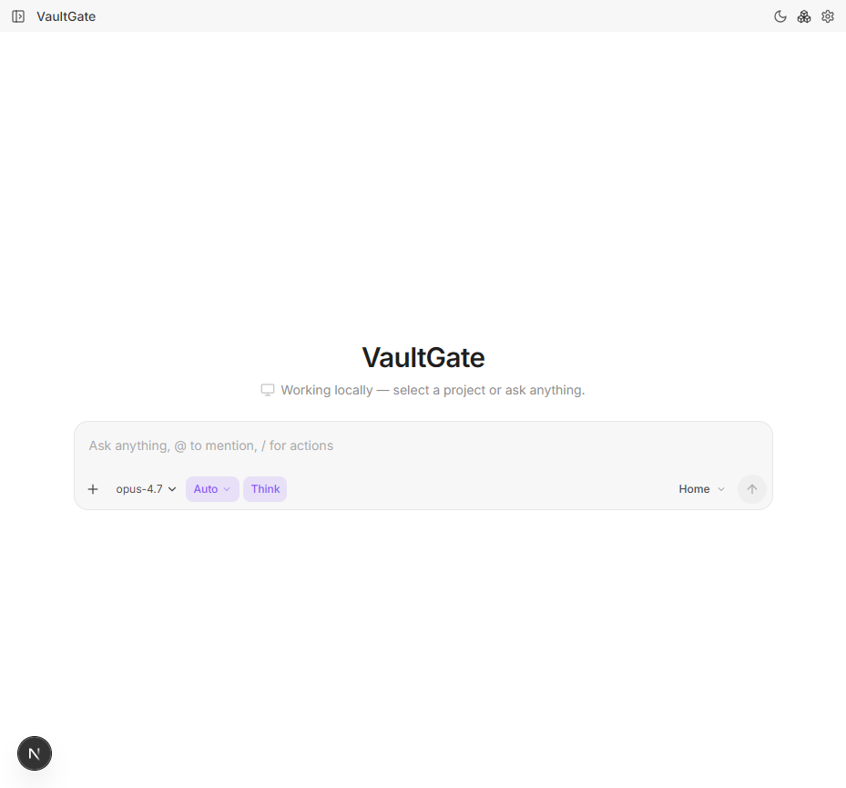
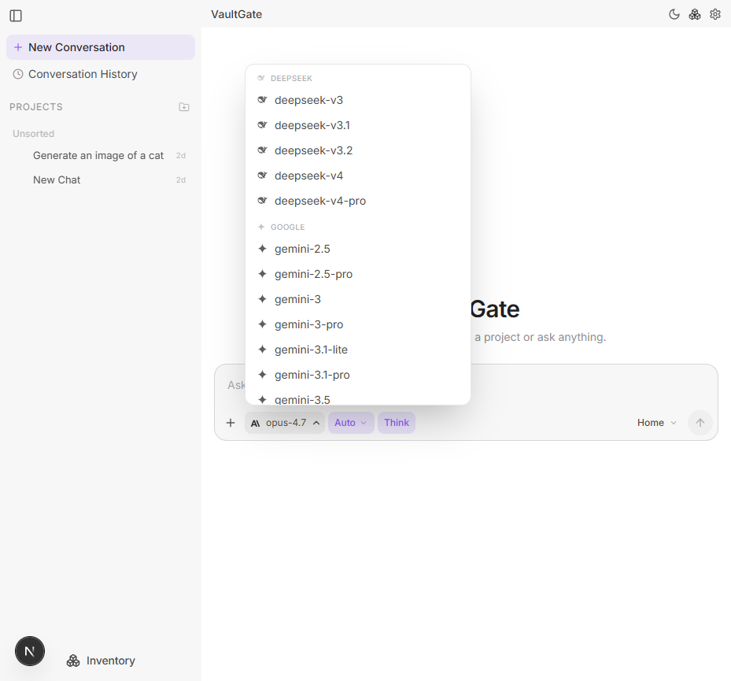

# VaultGate Agent

VaultGate Agent is a local-first AI agent desktop app built with Electron and
Next.js. It connects to any OpenAI-compatible endpoint, streams responses in real
time, stores chats locally, and gives each conversation an isolated workspace
with code, terminal, preview, and agent tools.



## Highlights

- **OpenAI-compatible providers**: use OpenAI, local models, LM Studio, Ollama-compatible gateways, or any endpoint that exposes the OpenAI chat/model APIs.
- **Real-time streaming**: token-by-token rendering is batched with `requestAnimationFrame` so long answers stay smooth.
- **Agent tools**: Bash, file read/write/edit, glob/grep/list, web fetch/search, todos, skills, sub-agents, and interactive questions.
- **Per-chat workspaces**: every chat gets an isolated local workspace with a file browser, terminal output, and live preview panel.
- **Local persistence**: chats, messages, settings, provider configuration, and workspace metadata stay on your machine.
- **Desktop shell**: Electron wraps the local Next.js app with a focused desktop experience and light/dark themes.

## Screenshots



## Status

VaultGate is actively developed and already includes the core desktop app,
streaming chat, provider settings, model fetching, local storage, agent loop,
tool execution, skills, and workspace panels.

See the deeper project notes in [`docs/SYSTEM.md`](docs/SYSTEM.md),
[`docs/ARCHITECTURE.md`](docs/ARCHITECTURE.md), and
[`docs/AUDIT.md`](docs/AUDIT.md).

## Requirements

- Node.js 20+
- npm
- PowerShell 7+ on Windows for the best local tool/runtime experience
- An OpenAI-compatible API endpoint and API key, unless you use a local endpoint that does not require a key

## Quick Start

```bash
npm install
npm run dev
```

Open `http://localhost:7483` for the web dev app.

For the full desktop app:

```bash
npm run electron:dev
```

On first launch, open **Settings**, add your provider endpoint and API key, fetch
models, choose a model, and start a chat.

## Configuration

Environment variables are only first-run defaults. Runtime settings are managed
inside the app and saved to the local SQLite database.

```bash
OPENAI_API_ENDPOINT=
OPENAI_API_KEY=
DEFAULT_MODEL=
VAULTGATE_DATA_DIR=./.data
```

Copy `.env.example` to `.env.local` if you want to seed default values during
development.

## Scripts

| Script | Purpose |
|---|---|
| `npm run dev` | Start the Next.js dev server on port `7483` |
| `npm run electron:dev` | Start Next.js and open the Electron desktop app |
| `npm run build` | Build the production Next.js app |
| `npm run electron:compile` | Compile Electron TypeScript files |
| `npm run electron:build` | Build and package the desktop app |
| `npm run typecheck` | Run TypeScript with `tsc --noEmit` |
| `npm run lint` | Run ESLint |

## Project Layout

| Path | Purpose |
|---|---|
| `src/app` | Next.js app routes, API routes, layout, and global styles |
| `src/components` | Chat UI, settings, markdown rendering, workspace panels, and shared UI |
| `src/lib/ai` | Provider calls, streaming parser, agent loop, prompts, and tool execution |
| `src/lib/db` | Local SQLite schema and repository layer |
| `src/lib/runtime` | Per-chat workspace, process, preview, history, and file runtime logic |
| `src/skills` | Bundled skill library available to the agent |
| `electron` | Electron main process and preload bridge |
| `docs` | Architecture, system, roadmap, and audit documentation |

## Local Data

Development data is stored under `./.data` by default, including the SQLite
database and generated workspaces. Packaged builds store data in Electron's OS
user-data directory.

Local runtime data, build outputs, reference folders, and vendor snapshots are
ignored by Git so the repository only contains VaultGate source, docs, configs,
lockfiles, and public assets.

## Safety Notes

VaultGate is a personal local agent app. Agent tools can run commands and edit
files inside the selected workspace, so only connect trusted models and review
tool activity. The app keeps provider secrets local and strips sensitive host
environment variables from spawned workspace commands.

## Validation

Before publishing changes, run:

```bash
npm run typecheck
npm run lint
npm run build
```

## License

No license has been added yet.
