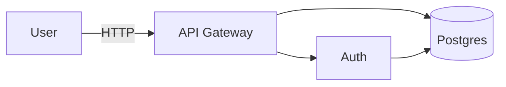
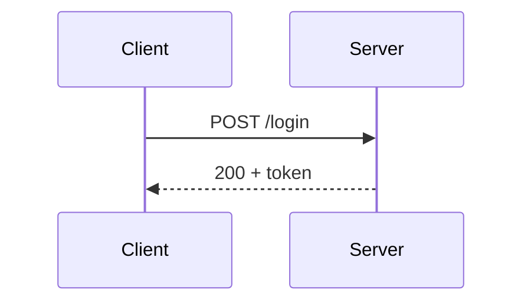

# Diagrams

Pick the output format to the job, then produce clean, self-contained source the user can open or edit.

## Choose the format

- **Mermaid** (default for flow/sequence/ER/state/class/gantt): fastest, text-based, renders in the chat and most markdown. Use for flowcharts, sequence diagrams, state machines, entity relationships.
- **SVG/HTML** (architecture, cloud, infra): when you need precise layout, real logos/boxes, gradients, and a polished dark-themed result. Emit one self-contained `.html` file under `download/` and link it.
- **Excalidraw JSON**: when the user wants a hand-drawn, editable sketch they can open at excalidraw.com. Emit a `.excalidraw` (JSON) file.

## Mermaid (quick start)

````md

````
Sequence:
````md

````
Keep labels short, group with `subgraph`, direction `LR`/`TB` for readability.

## Architecture / infra (SVG-HTML)

Produce a single dark-themed HTML file: tidy boxes with titles + sublabels, grouped layers (client / edge / services / data), orthogonal connectors with arrowheads, a legend. Use a restrained palette and consistent spacing. Save to `download/architecture.html`. Prefer real component names over generic blobs.

## Concept maps & hand-drawn

- **Concept map:** nodes = ideas, labeled edges = relationships; radial or layered layout. Mermaid `flowchart` or SVG both work.
- **Excalidraw:** generate valid Excalidraw JSON (`type:"excalidraw"`, `elements:[…]`, `appState`) with rectangles/ellipses/arrows/text and the rough/hand-drawn style. Save as `download/sketch.excalidraw`.

## Quality bar

Correct topology first, then aesthetics: align elements to a grid, avoid crossing lines, label every edge that needs it, and make text legible. Always save the source file and give the user a `download/…` link so they can edit it. For **data** visualization (bar/line/pie from numbers), use the **charts** skill instead.
